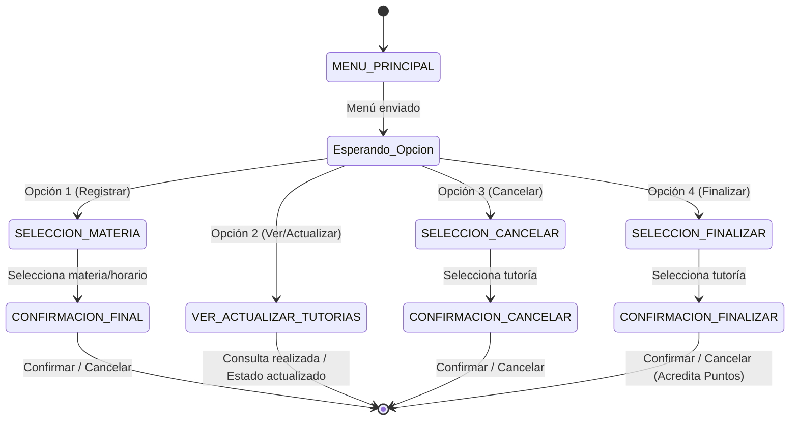
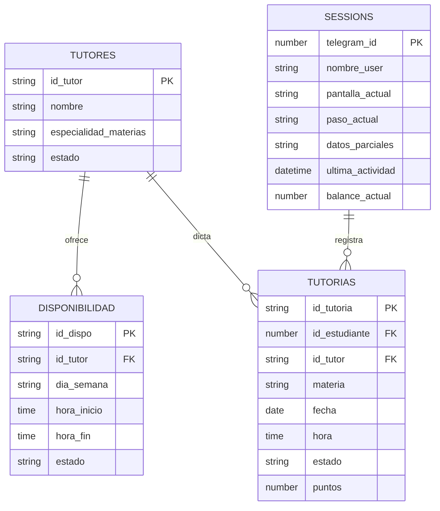

# TutorBot — Bot de Tutorías Académicas en Telegram (n8n)

> **TutorBot** es una solución automatizada de gestión de tutorías académicas orquestada mediante **n8n**. Conecta a estudiantes y tutores mediante un motor de asignación inteligente, gestionando desde la solicitud inicial hasta la finalización de la asesoría. Elimina cruces de agenda, brinda trazabilidad del proceso y centraliza la disponibilidad en tiempo real.

---

## 🔗 Recursos del Proyecto

* **🤖 Bot de Telegram:** [@Lucia_M_458bot](https://t.me/Lucia_M_458bot)
* **📊 Base de Datos (Google Sheets):** [TutorBot_DB](https://docs.google.com/spreadsheets/d/1Sy-9QIGkl6i24EW5DOCMwk8nAhnUR-U9Gs-KZk5evyc/edit?usp=sharing)
* **🔑 Token del Bot:** `8354497610:AAGVbeJsPMneGSH-h65FRhPjIX4oyIC5T46`

---

## 🎯 Objetivos del Sistema

1. **Gestión Automatizada:** Integrar Telegram, Google Sheets y lógica avanzada de workflows en n8n.
2. **Motor de Búsqueda e Imparcialidad:** Asociar automáticamente materia, tutor y horario libre sin duplicidad de reservas.
3. **Autogestión Conversacional:** Permitir al estudiante solicitar, consultar, actualizar, cancelar y finalizar tutorías en formato guiado (Wizard).
4. **Control de Ciclo de Vida:** Controlar de forma precisa los estados (`Por iniciar` $\rightarrow$ `En progreso` $\rightarrow$ `Finalizada` / `Cancelada`).
5. **Gamificación y Reportes:** Acumular puntos/balance académico por tutorías completadas exitosamente.

---

## 📋 Tabla de Contenidos

- [TutorBot — Bot de Tutorías Académicas en Telegram (n8n)](#tutorbot--bot-de-tutorías-académicas-en-telegram-n8n)
  - [🔗 Recursos del Proyecto](#-recursos-del-proyecto)
  - [🎯 Objetivos del Sistema](#-objetivos-del-sistema)
  - [📋 Tabla de Contenidos](#-tabla-de-contenidos)
  - [💻 Funcionalidades Principales](#-funcionalidades-principales)
  - [📱 Guía de Uso del Usuario Final](#-guía-de-uso-del-usuario-final)
  - [🔄 Máquina de Estados (Wizard de Conversación)](#-máquina-de-estados-wizard-de-conversación)
  - [🗄️ Arquitectura del Modelo de Datos (Google Sheets)](#️-arquitectura-del-modelo-de-datos-google-sheets)
  - [🔀 Detalle de Ramas de Flujo en n8n](#-detalle-de-ramas-de-flujo-en-n8n)
  - [🚀 Instalación y Configuración](#-instalación-y-configuración)
  - [⚠️ Limitaciones y Mejoras Futuras](#-limitaciones-y-mejoras-futuras)

---

## 👤 Implementaciones y Pruebas (Evaluación Examen)

**Desarrollado por:** Henrik Anderson Oloroso García

### 1. Modificaciones a la Lógica de Negocio
* **Nueva Opción del Menú:** En el nodo `Switch` principal de enrutamiento, se integró una rama adicional para la opción **Ver y actualizar mis tutorías**, permitiendo consultar el estado actual y gestionar las asesorías agendadas.
* **Sistema de Puntos y Balance Académico:**
  * **Hoja `SESSIONS`:** Se incorporó la columna `balance_actual`, encargada de acumular el total de puntos obtenidos por el alumno al finalizar sus asesorías.
  * **Hoja `TUTORIAS`:** Se añadió la columna `puntos`, que almacena la puntuación asignada por materia a la cual se inscribió el estudiante. Al cambiar el estado a `Finalizada`, los puntos de dicha tutoría se acreditan al `balance_actual` del usuario en la sesión.
* **Integración de IA (Agente Inteligente):** Se integró un nodo `AI Agent` impulsado por **Google Gemini Chat Model** y soportado por `Simple Memory`, permitiendo responder consultas complejas o guiar al usuario fuera de la secuencia estática cuando la condición general se cumple.
---

## 💻 Funcionalidades Principales

| Opción | Comando / Menú | Acción Ejecutada |
| :---: | :--- | :--- |
| **1️⃣** | **Registrar tutoría** | Despliega catálogo de tutores y materias filtrando por disponibilidad `Libre`. |
| **2️⃣** | **Ver/Actualizar tutorías** | Consulta las tutorías asociadas al estudiante y permite gestionar actualizaciones. |
| **3️⃣** | **Cancelar tutoría** | Permite dar de baja tutorías en estado `Por iniciar` o `En progreso`. |
| **4️⃣** | **Finalizar tutoría** | Marca la clase como `Finalizada`, liberando al tutor e incrementando el `balance_actual` de puntos del estudiante. |

---

## 📱 Guía de Uso del Usuario Final

1. **Inicio de sesión:** Abre [@Lucia_M_458bot](https://t.me/Lucia_M_458bot) en Telegram y envía cualquier mensaje.
2. **Navegación en Menú Principal:**
   ```text
   🤖 Asistente IA: 
    ¡Hola! Soy tu asistente de tutorías personal. Estoy aquí para ayudarte a organizar tus sesiones de estudio y resolver tus dudas. ✨

    ¿En qué puedo asistirte hoy? Aquí tienes las opciones disponibles:
    1) Registrar una tutoría 📚
    2) Ver tus tutorías 📝
    3) Cancelar una tutoria 🚫
    4) Finalizar sesión ✨
    5) Ver y actualizar mis puntos 🎓

    Para elegir, ingresa únicamente números.

**Flujo Guiado (Wizard):**

- Registrar (1): El bot presenta la lista de horarios y materias disponibles. Selecciona el número correspondiente y confirma usando los botones inline Confirmar / Cancelar.

- Ver/Actualizar (2): Lista las tutorías del usuario mostrando su estado actual y detalle de puntos.

- Cancelar (3): Muestra tutorías activas (Por iniciar / En progreso). Elige la que deseas cancelar y confirma la acción.

- Finalizar (4): Lista únicamente tutorías En progreso. Al confirmar, el estado cambia a Finalizada y se transfieren los puntos acumulados al balance del estudiante.

## 🔄 Máquina de Estados (Wizard de Conversación)

La persistencia del flujo conversacional se gestiona en la hoja SESSIONS, previniendo la pérdida de contexto en interacciones de múltiples pasos:



## 🗄️ Arquitectura del Modelo de Datos (Google Sheets)
El almacenamiento relacional está implementado en la hoja TUTORES (ID: 1Sy-9QIGkl6i24EW5DOCMwk8nAhnUR-U9Gs-KZk5evyc), estructurada con las siguientes 4 pestañas:

Diagrama Entidad-Relación (ER)



*⚠️ Nota de implementación: La columna datos_parciales almacena las opciones formateadas en JSON para ser leídas con JSON.parse() en la siguiente interacción del usuario.*

## 🔀 Detalle de Ramas de Flujo en n8n

- **🟢 Rama 1** — Registrar tutoría:registrar (trigger) $\rightarrow$ Select Tutores + Select Materias $\rightarrow$ Code in JavaScript (cruza tutores con disponibilidad libre) $\rightarrow$ Actualizar datos_parciales $\rightarrow$ Selección del usuario $\rightarrow$ Buscar por id1 $\rightarrow$ Envia confirmacion (botones inline) $\rightarrow$ Confirmar (callback) $\rightarrow$ Code (calcula id_tutoria consecutivo) $\rightarrow$ Adjuntar fila a tutorias $\rightarrow$ Mensaje "✅ Tutoría registrada exitosamente".

- **🔵 Rama 2** — Ver y actualizar mis tutorías:Mis tutorias $\rightarrow$ Obtener datos (lee TUTORIAS por id_estudiante) $\rightarrow$ Parsear datos (formatea resumen con emojis y puntos) $\rightarrow$ Actualizar datos_parciales1 $\rightarrow$ Tutorias registradas (envío del listado).

- **🟠 Rama 3** — Cancelar tutoría:Cancelar tutoria $\rightarrow$ Obtener datos1 (filtra Por iniciar / En progreso) $\rightarrow$ Parsear datos1 $\rightarrow$ Tutorias que se pueden cancelar $\rightarrow$ Selección del usuario $\rightarrow$ Buscar por id3 $\rightarrow$ Code in JavaScript3 $\rightarrow$ Envia confirmacion1 $\rightarrow$ Update row in sheet1 (cambia estado a Cancelada).

- **🔴 Rama 4** — Finalizar tutoría:Finalizar tutoria $\rightarrow$ Obtener datos2 (filtra En progreso) $\rightarrow$ Parsear datos2 $\rightarrow$ Tutorias que se pueden finalizar $\rightarrow$ Selección del usuario $\rightarrow$ Buscar por id4 $\rightarrow$ Code in JavaScript5 $\rightarrow$ Update row in sheet2 (cambia estado a Finalizada) $\rightarrow$ Suma de puntos al balance_actual del usuario.

- **🤖 Rama Especial** — Agente de Inteligencia Artificial:Ante entradas no estructuradas o desviaciones de la máquina de estados, el flujo deriva el mensaje hacia un nodo AI Agent integrado con el modelo Google Gemini Chat Model y Simple Memory, ofreciendo soporte conversacional contextualizado antes de redirigir al menú.

## 🚀 Instalación y Configuración

1. **Importación del Workflow:** Carga el archivo `TutorBot.json` en n8n desde **Workflows → Import from File**.

2. **Configuración de Google Sheets:**
   - Conecta tu credencial de OAuth2 para Google Sheets.
   - Apunta a la hoja de cálculo: [TutorBot_DB](https://docs.google.com/spreadsheets/d/1Sy-9QIGkl6i24EW5DOCMwk8nAhnUR-U9Gs-KZk5evyc/edit?usp=sharing)

3. **Configuración del Bot de Telegram:**
   - Asigna las credenciales utilizando el token de **@BotFather: `8354497610:AAGVbeJsPMneGSH-h65FRhPjIX4oyIC5T46`** en todos los nodos de tipo **Telegram Trigger** y **Telegram**.

4. **Verificación del Modelo de Datos:** Revisa que los nombres de las 4 pestañas y sus encabezados coincidan exactamente con la sección **Modelo de Datos**.

5. **Activación:** Activa el flujo (**Active / ON**) para permitir la escucha continua de mensajes ejecutando el workflow, o bien publicandolo (**Publish**)

