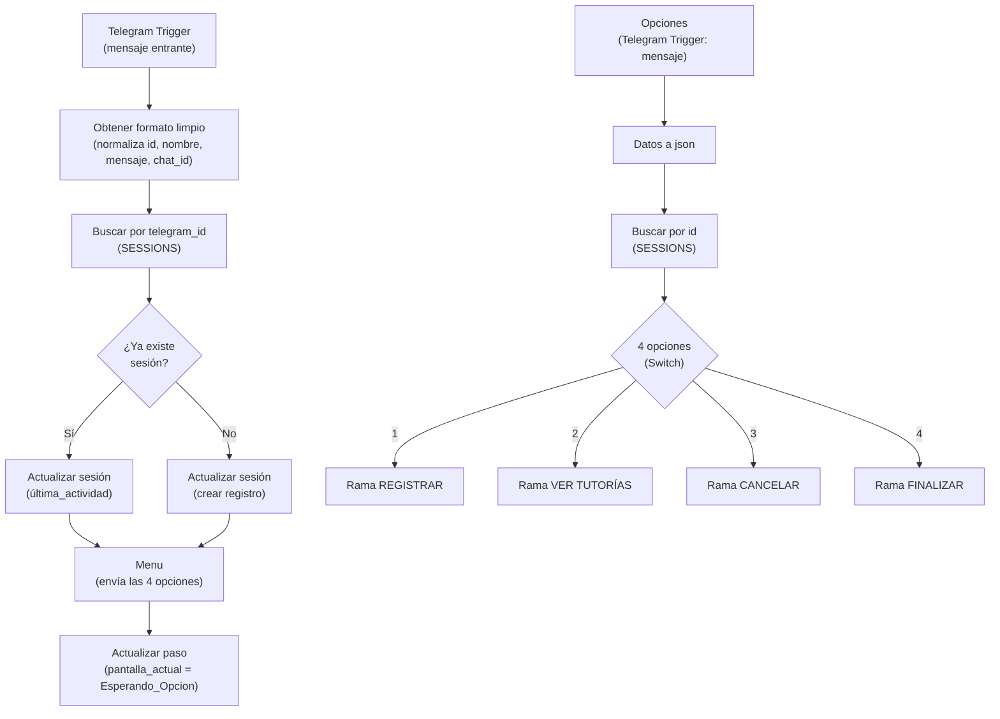
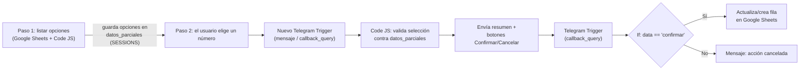
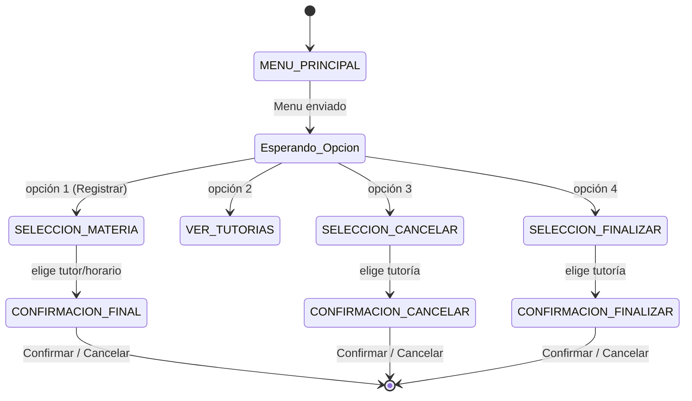
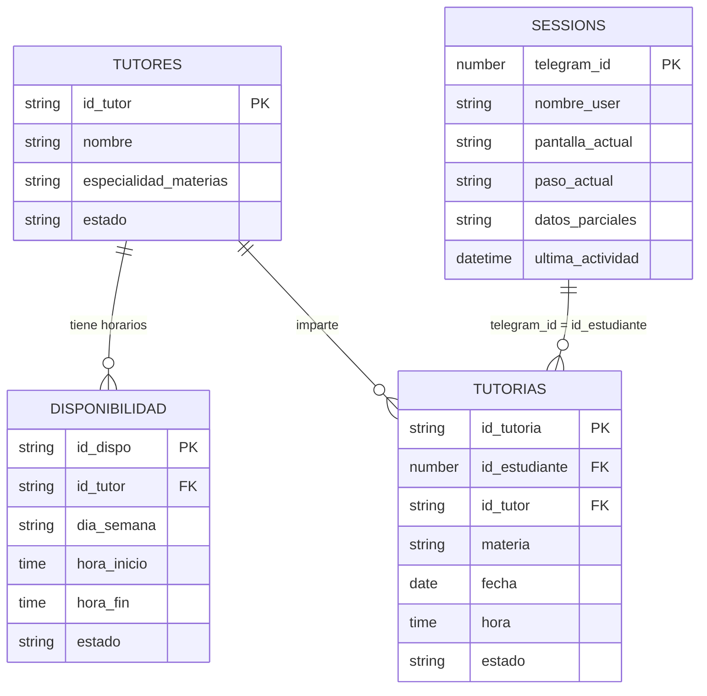

# TutorBot 2 — Bot de Tutorías en Telegram (n8n)

Bot conversacional en **Telegram**, construido con **n8n**, que permite a estudiantes registrarse, consultar, cancelar y finalizar tutorías académicas. Toda la información (tutores, disponibilidad, tutorías y sesiones de conversación) se almacena en una **Google Sheet** que actúa como base de datos.

🤖 **Bot en Telegram:** [@Lucia_M_458bot](https://t.me/Lucia_M_458bot)
📊 **Enlace Google Sheets:**[Tutores](https://docs.google.com/spreadsheets/d/1Sy-9QIGkl6i24EW5DOCMwk8nAhnUR-U9Gs-KZk5evyc/edit?usp=sharing)


---

## Tabla de contenidos

1. [¿Qué hace el bot?](#qué-hace-el-bot)
2. [Cómo usar el bot (guía para el usuario final)](#cómo-usar-el-bot-guía-para-el-usuario-final)
3. [Arquitectura técnica del flujo](#arquitectura-técnica-del-flujo)
4. [Máquina de estados de la sesión](#máquina-de-estados-de-la-sesión)
5. [Organización de los datos (Google Sheets)](#organización-de-los-datos-google-sheets)
6. [Detalle de cada rama del flujo](#detalle-de-cada-rama-del-flujo)
7. [Instalación y configuración](#instalación-y-configuración)
8. [Estructura de nodos en n8n](#estructura-de-nodos-en-n8n)
9. [Limitaciones y mejoras futuras](#limitaciones-y-mejoras-futuras)

---

## ¿Qué hace el bot?

Desde Telegram, un estudiante puede:

| Opción | Acción |
|---|---|
| 1️⃣ | **Registrarse** a una tutoría (elige tutor/materia/horario disponible) |
| 2️⃣ | **Ver sus tutorías** registradas |
| 3️⃣ | **Cancelar** una tutoría (en estado "Por iniciar" o "En progreso") |
| 4️⃣ | **Finalizar** una tutoría que está en progreso |

El bot recuerda en qué paso de la conversación se encuentra cada usuario (gracias a la hoja `SESSIONS`), por lo que puede tener múltiples conversaciones simultáneas con distintos estudiantes sin perder el hilo.

---

## Cómo usar el bot (guía para el usuario final)

1. **Iniciar conversación**: el estudiante abre [@Lucia_M_458bot](https://t.me/Lucia_M_458bot) en Telegram y escribe cualquier mensaje.
2. El bot responde con el **menú principal**:

   ```
   Hola {nombre}

   Bienvenido al sistema de tutorías.

   ¿Qué deseas hacer?
   1. Registrarme a una tutoría
   2. Ver mis tutorías
   3. Cancelar una tutoría
   4. Finalizar una tutoría
   ```
3. El usuario responde **solo con el número** (1, 2, 3 o 4).
4. Según la opción, el bot continúa el diálogo:
   - **Registrar (1)**: muestra la lista numerada de tutores/materias/horarios disponibles → el usuario elige un número → el bot muestra un resumen con botones **Confirmar / Cancelar** → al confirmar, se crea la tutoría.
   - **Ver mis tutorías (2)**: el bot lista todas las tutorías asociadas a ese `telegram_id`.
   - **Cancelar (3)**: el bot lista las tutorías en estado *Por iniciar* o *En progreso* → el usuario elige el número → botones **Confirmar / Cancelar** → al confirmar, el estado cambia a *Cancelada*.
   - **Finalizar (4)**: igual que cancelar, pero solo lista tutorías *En progreso* y, al confirmar, el estado cambia a *Finalizada*.
5. En cualquier punto donde se piden botones inline, el usuario debe **presionar el botón** (no escribir texto) para confirmar o cancelar la acción.

---

## Arquitectura técnica del flujo

El workflow tiene **4 disparadores de tipo texto** (uno por cada opción del menú) y **3 disparadores de tipo `callback_query`** (para los botones Confirmar/Cancelar de cada rama), además del disparador inicial del menú:



Cada una de las 4 ramas sigue el mismo **patrón de 2 pasos**:



---

## Máquina de estados de la sesión

Cada usuario tiene una fila en la hoja `SESSIONS` que funciona como su "memoria" de conversación:



> Los valores exactos de `pantalla_actual` / `paso_actual` se guardan como texto libre en la hoja `SESSIONS` (por ejemplo `Esperando_Opcion`, `RESERVA_FECHA`, `CONFIRMACION_FINAL`) y los interpreta cada rama del flujo.

---

## Organización de los datos (Google Sheets)

Toda la información vive en **un único archivo de Google Sheets** (referenciado en n8n como documento `TUTORES`, ID `1Sy-9QIGkl6i24EW5DOCMwk8nAhnUR-U9Gs-KZk5evyc`), con **4 pestañas**:



### 1. Hoja `TUTORES`
Catálogo de tutores disponibles.

| Columna | Tipo | Descripción |
|---|---|---|
| `id_tutor` | texto (PK) | Identificador único del tutor, ej. `TUT001` |
| `nombre` | texto | Nombre completo del tutor |
| `especialidad_materias` | texto | Materia(s) que imparte |
| `estado` | texto | `Activo` / `Inactivo` |

### 2. Hoja `DISPONIBILIDAD`
Horarios que cada tutor tiene abiertos.

| Columna | Tipo | Descripción |
|---|---|---|
| `id_dispo` | texto (PK) | Identificador del bloque de horario, ej. `DISP001` |
| `id_tutor` | texto (FK → TUTORES) | Tutor al que pertenece el horario |
| `dia_semana` | texto | Lunes, Martes, ... |
| `hora_inicio` | hora | Hora de inicio del bloque |
| `hora_fin` | hora | Hora de fin del bloque |
| `estado` | texto | `Libre` / `Ocupado` — solo los `Libre` se ofrecen al registrar una tutoría |

### 3. Hoja `TUTORIAS`
Registro histórico y activo de tutorías agendadas.

| Columna | Tipo | Descripción |
|---|---|---|
| `id_tutoria` | texto (PK) | Identificador consecutivo, ej. `TUTOR001` (se calcula tomando el máximo id existente + 1) |
| `id_estudiante` | número | `telegram_id` del alumno que agendó |
| `id_tutor` | texto (FK → TUTORES) | Tutor asignado |
| `materia` | texto | Materia de la tutoría |
| `fecha` | fecha | Fecha agendada |
| `hora` | hora | Hora agendada |
| `estado` | texto | `Por iniciar` → `En progreso` → `Finalizada`, o `Cancelada` |

### 4. Hoja `SESSIONS`
Estado de la conversación de cada usuario de Telegram (funciona como "memoria" temporal del bot).

| Columna | Tipo | Descripción |
|---|---|---|
| `telegram_id` | número (PK) | ID de Telegram del usuario (`message.from.id`) |
| `nombre_user` | texto | Nombre del usuario tal como lo reporta Telegram |
| `pantalla_actual` | texto | Pantalla/menú en la que se encuentra el usuario |
| `paso_actual` | texto/número | Paso puntual dentro de esa pantalla |
| `datos_parciales` | texto (JSON) | Objeto JSON con las opciones mostradas y/o los datos que el usuario ha ido seleccionando (ej. `{"id_tutor":"TUT002","materia":"Química"}` o `{"accion":"finalizar_tutoria","opciones":[...]}`) |
| `ultima_actividad` | fecha/hora | Marca de tiempo de la última interacción |

> ⚠️ La columna `datos_parciales` es el "pegamento" del flujo: cada rama escribe ahí las opciones numeradas que le mostró al usuario, y en el siguiente mensaje se relee y se parsea con `JSON.parse()` para saber qué eligió.

---

## Detalle de cada rama del flujo

### 🟢 Rama 1 — Registrar tutoría
Nodos clave: `registrar` (trigger) → `Select Tutores` + `Select Materias` → `Code in JavaScript` (cruza tutores con disponibilidad `Libre` y arma la lista numerada) → `Actualizar datos_parciales` → usuario responde número → `Buscar por id1` → `Code in JavaScript1` (valida la opción elegida) → `Envia confirmacion` (botones Confirmar/Cancelar) → `Confirmar` (callback) → `If1` → si confirma: `Code in JavaScript2` (genera `id_tutoria` consecutivo) → `Adjuntar fila a tutorias` (crea la fila en `TUTORIAS`) → `Send a text message` ("✅ Tutoría registrada exitosamente"); si cancela: `Registro cancelado`.

### 🔵 Rama 2 — Ver mis tutorías
Nodos clave: `Mis tutorias` → `Obtener datos` (lee `TUTORIAS` filtrando por `id_estudiante`) → `Parsear datos` (arma el mensaje con emojis, una línea por tutoría) → `Tutorias registradas` (envía el listado).

### 🟠 Rama 3 — Cancelar tutoría
Nodos clave: `Cancelar tutoria` → `Obtener datos1` → `Parsear datos1` (filtra solo estados `Por iniciar` / `En progreso` y elimina duplicados) → `Tutorias que se pueden cancelar` → usuario elige número → `Buscar por id3` → `Code in JavaScript3` (valida elección) → `Envia confirmacion1` (botones) → `Confirmar1` (callback) → `If2` → si confirma: `Code in JavaScript4` + `Actualizar estado` (cambia `estado` a `Cancelada` en `TUTORIAS`) → `Send a text message1`; si cancela: `Registro cancelado1`.

### 🔴 Rama 4 — Finalizar tutoría
Nodos clave: `Finalizar tutoria` → `Obtener datos2` → `Parsear datos2` (filtra solo `En progreso`) → `Tutorias que se pueden finalizar` → usuario elige número → `Buscar por id4` → `Code in JavaScript5` (valida elección) → `Envia confirmacion2` (botones) → `Confirmar2` (callback) → `If3` → si confirma: `Code in JavaScript6` + `Actualizar estado1` (cambia `estado` a `Finalizada`) → `Send a text message2`; si cancela: `Registro cancelado2`.

---

## Instalación y configuración

### Requisitos previos
- Una instancia de **n8n** (cloud o self-hosted).
- Un **bot de Telegram** creado con [@BotFather](https://t.me/BotFather) y su token.
- Una **Google Sheet** con las 4 pestañas descritas arriba (puedes usar `TUTORES.xlsx` como plantilla base y subirla a Google Drive).
- Credenciales de **Google Sheets OAuth2** configuradas en n8n.
- Credenciales del **Bot de Telegram** configuradas en n8n.

### Pasos
1. Importa el archivo `TutorBot_2.json` en n8n (`Workflows → Import from File`).
2. En cada nodo de tipo **Google Sheets**, selecciona tu propia credencial y vuelve a apuntar el `documentId` hacia tu copia de la hoja de cálculo (actualmente apunta al documento `TUTORES` con ID `1Sy-9QIGkl6i24EW5DOCMwk8nAhnUR-U9Gs-KZk5evyc`).
3. En cada nodo de tipo **Telegram Trigger** y **Telegram** (envío de mensajes), selecciona tu credencial del bot.
4. Verifica que las 4 pestañas de tu Google Sheet tengan exactamente los encabezados descritos en la sección [Organización de los datos](#organización-de-los-datos-google-sheets) (los nombres de columna se usan como referencia directa en los nodos).
5. Activa el workflow (`Active`) o pruébalo con **Execute workflow → from Telegram Trigger**.
6. Escríbele a tu bot desde Telegram para iniciar la conversación.

---

## Estructura de nodos en n8n

El workflow completo cuenta con **81 nodos**, agrupados así:

| Tipo de nodo | Cantidad aprox. | Uso |
|---|---|---|
| `telegramTrigger` | 8 | Un trigger de mensaje/callback por cada punto de entrada del usuario (menú, cada rama y cada confirmación) |
| `telegram` | 12 | Envío de mensajes y menús con botones inline |
| `googleSheets` | 33 | Lectura/escritura sobre las 4 pestañas de la hoja de cálculo |
| `code` (JavaScript) | 9 | Lógica de parseo, formateo de mensajes y validación de selecciones |
| `set` | 9 | Normalización de los datos entrantes de Telegram a un JSON limpio |
| `if` / `switch` | 6 | Enrutamiento según sesión existente, opción del menú o confirmación del usuario |

Puedes ver la captura completa del canvas al inicio de este documento (`flujo_completo.png`).

---

## Limitaciones y mejoras futuras

- No hay manejo de **concurrencia**: si dos usuarios agendan el mismo horario casi simultáneamente, no hay bloqueo pessimista sobre `DISPONIBILIDAD`.
- El campo `datos_parciales` almacena JSON como texto plano; un error de formato (comillas, tildes) puede romper el `JSON.parse()` en el siguiente paso.
- No hay comando de **cancelación global** (ej. `/cancelar`) para salir de un flujo a medio camino y volver al menú.
- No hay recordatorios automáticos (ej. avisar 1 hora antes de la tutoría).
- Los `id_tutoria` se calculan buscando el máximo existente + 1 en cada ejecución, lo cual no escala bien con mucho volumen concurrente; se recomienda migrar a un generador de IDs atómico si el uso crece.
